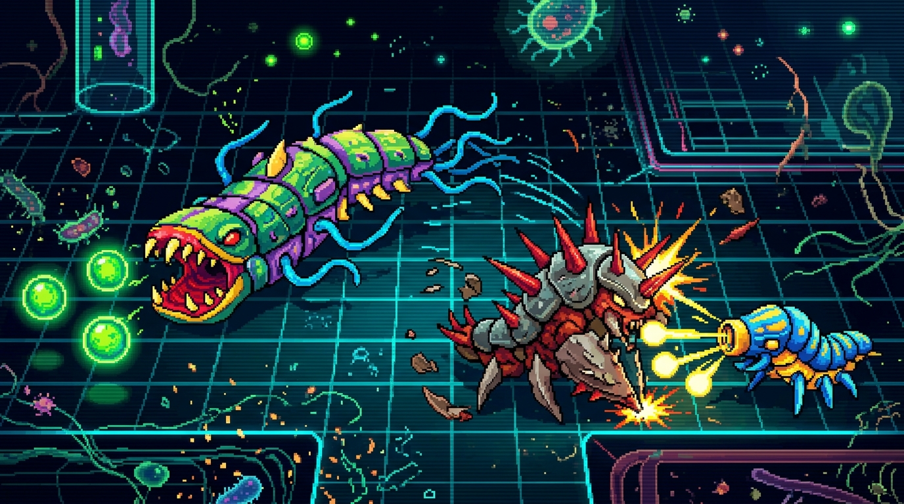
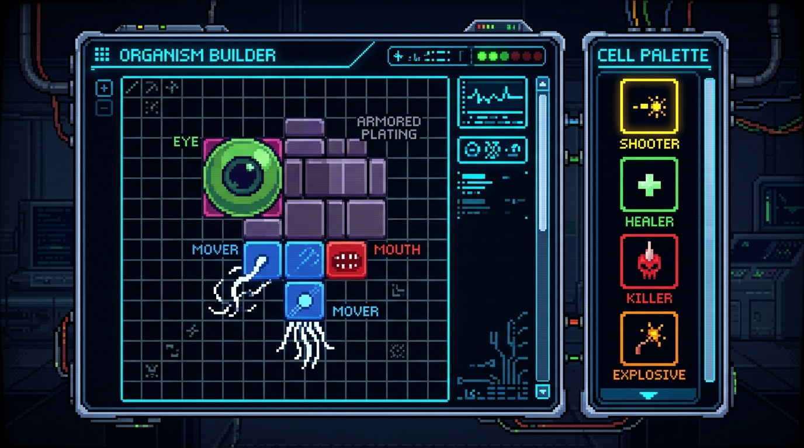

# The Life Engine — Pixel-Art Concepts

This concept art is based directly on the game mechanics detailed in the codebase:
1. **Modular Organisms**: Creatures are composed of distinct tile cells, each carrying out a single biological role (e.g., eating, moving, seeing, shooting, shield/armor).
2. **Dynamic Arena**: The sandbox is a dark, grid-based environment where organisms hunt food, run away, shoot, explode, or split to reproduce.
3. **The Organism Lab**: A blueprint construction grid where players place custom cell components from a palette onto a grid canvas to spawn customized life-forms.

Here are two distinct concepts showing how the game's mechanics would look in a premium 16-bit retro arcade aesthetic:

## 1. Gameplay Concept: The Evolution Arena

## 2. Creator Concept: The Organism Lab

***

## Visual Representation of Key Game Mechanics

| Game Mechanic | Engine Behavior | Concept Art Visual Representation |
| :--- | :--- | :--- |
| **Mouth Cell** | Eats adjacent food. | Snapping jaws or vacuum-like mouth apertures. |
| **Mover Cell** | Moves and turns the organism. | Squirming tails, flagella, cilia, or propulsion tubes. |
| **Armor Cell** | Blocks killer cells from harming. | Heavy chitinous plates or metallic gray scales. |
| **Killer Cell** | Harms other organisms it touches. | Neon-red spikes, stinger needles, or acid-dripping nodes. |
| **Shooter Cell**| Fires projectiles at targets. | Cannon-like snouts or spore-spitting turrets. |
| **Eye Cell** | Sees ahead and controls mover direction. | Large rotating glowing eyeballs with slit pupils. |
| **Food Spore** | Consumed by mouth cells for energy. | Floating, glowing green bioluminescent spheres. |
| **The Grid** | Empty background cells and wall structures. | Cybernetic gridlines with organic cellular debris and jagged rocky walls. |
