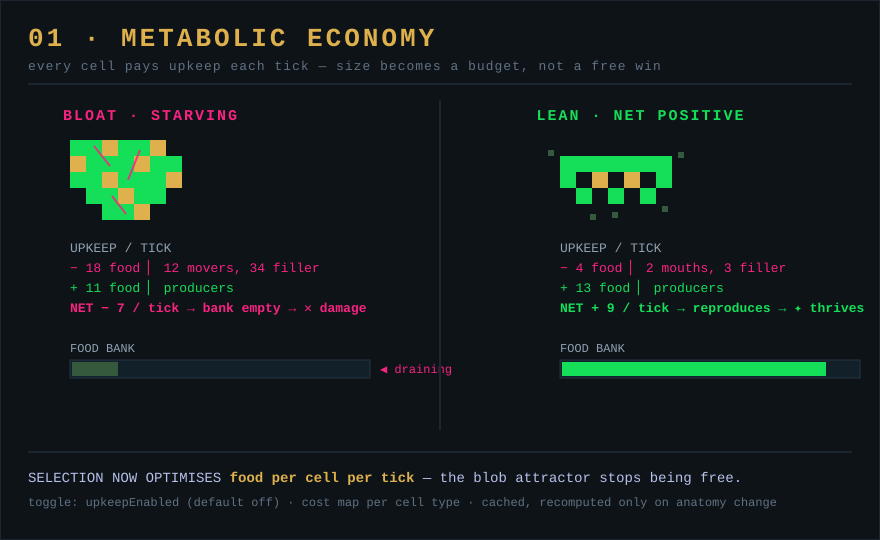

# 01 — Metabolic economy

*Aim: overhaul evolution · Effort: S–M · Leverage: highest · Risk: low*



## Problem

Food is effectively free. A producer grows food in nearby empty cells for no
cost, an organism reproduces once it has banked `cells.length` food, and lifespan
just grows with body size. So the fitness gradient points one way on almost every
world: **get bigger, add producers, tile the map.** Once a blob wins there is
nothing left to select against it, and the sim goes quiet — the single biggest
reason watching stops being rewarding.

## Current code

- `foodNeeded()` — flat `this.anatomy.cells.length` (`+extraMoverFoodCost` for
  movers). `Organism.ts:256`.
- `lifespan()` — `cells.length * lifespanMultiplier`, so bigger = longer-lived.
  `Organism.ts:260`.
- Reproduction spends exactly `foodNeeded()` and banks the rest. `Organism.ts:345`.
- Producers grow food every tick at `foodProdProb` with no upkeep. Producer cell.

There is no per-tick running cost anywhere. Size has upside and no downside.

## Proposal

Introduce **metabolic upkeep**: every tick, an organism pays food proportional to
what its body *does*, drawn from its food bank; when the bank can't cover upkeep,
it starts starving (take damage, or dock lifespan). Cost is per-cell-type so body
composition becomes a real budget:

| Cell | Upkeep intuition |
| --- | --- |
| Mover | high — locomotion is expensive |
| Killer / Shooter / Explosive | moderate — weapons cost to carry |
| Eye / brain | small — sensing is cheap but not free |
| Producer | **negative** (net income) — it's the engine's food source |
| Mouth / Armor / Common | ~zero — structural |

New hyperparameters (mirror the existing `HyperparamsData` pattern in
`Hyperparameters.ts:6`, defaulted in `applyDefaults`): `upkeepEnabled`,
`upkeepPerCell` map, `starvationDamage`. Default the whole system **off** so
existing worlds and saves are unchanged; it's an Evolution-Controls toggle.

Sketch, folded into the existing per-tick update (`Organism.update`, near the
reproduce check at `Organism.ts:654`):

```ts
if (hp.upkeepEnabled) {
  let cost = 0;
  for (const cell of this.anatomy.cells) cost += hp.upkeepPerCell[cell.state.name] ?? 0;
  this.food_collected -= cost;               // producers push this negative-cost
  if (this.food_collected < 0) {             // can't pay: starve
    this.food_collected = 0;
    this.applyStarvation(hp.starvationDamage);
  }
}
```

## Why it's exciting

- **Blobs stop being free.** A 200-cell producer mat now bleeds upkeep unless
  enough of it is producers *and* it can still out-earn its own maintenance.
  Efficiency — food per cell per tick — becomes the thing selection optimises,
  and efficiency has interesting local optima (thin producer fringes, minimal
  hunters, mixed farmers) instead of one blob attractor.
- **Trade-offs become visible.** Movers and weapons now cost something, so
  predators must actually out-earn their metabolism by eating — the first real
  predator/prey energy balance in the sim.
- **A tuning knob for pace.** Cranking upkeep is a fast "hard times" lever; the
  Narrator already fires mass-extinction toasts, so a metabolic squeeze produces
  a readable die-off and rebound.

## Effort

Small–medium. One field on the organism's per-tick path, one hyperparam block,
one Evolution-Controls section. No serialization break (default off). The one
subtlety is where starvation lands — prefer docking the food bank + damage over a
new death path, to reuse existing death/fossilize plumbing.

## Risks

- **Balance.** Too-high upkeep collapses everything to bare producers; too-low
  changes nothing. Ship with conservative defaults and expose the map.
- **Perf.** Adds a per-organism cell loop each tick. Cheap, but the codebase
  cares (`TODO.md` perf section) — cache a per-organism `upkeep_total`,
  recomputed only on anatomy change (`Anatomy.checkTypeChange`, `Anatomy.ts:147`),
  instead of summing every tick.

## Tests

- Upkeep off → tick-for-tick identical to today (guard the default).
- An all-producer organism nets positive; an all-mover organism starves in open
  space; upkeep total updates when a mutation adds/removes a cell.
