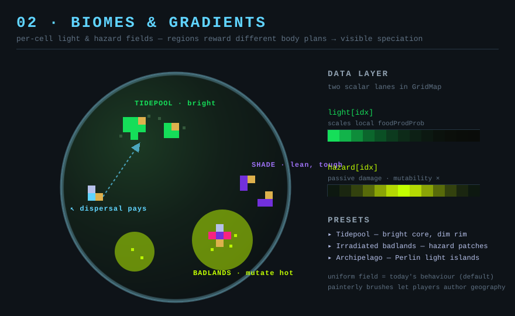

# 02 — Biomes & gradients

*Aim: overhaul evolution · Effort: M · Leverage: high · Risk: medium*

## Problem

The world interior is one uniform niche. The only spatial structure is the
decorative petri-dish rim (`WorldEnvironment.ts:685` — rendering only) and a
*global* day/night flip that toggles the whole board at once
(`WorldEnvironment.ts:318`, `is_night` read by `EyeCell`). Because every location
rewards the same body plan, there is no reason for two different forms to persist
side by side — so no niche partitioning, and speciation is just drift, not
adaptation to *somewhere*. The map looks the same everywhere it isn't empty.

## Current code

- Food production is a single global probability, `foodProdProb`
  (`Hyperparameters.ts`), applied uniformly by producers.
- `is_night` is one boolean for the whole world (`WorldEnvironment.ts:248`).
- `GridMap` is already parallel typed arrays indexed `col*rows + row`
  (`TODO.md` typed-array note) — there is a natural home for a per-cell scalar
  field, and `setDish` already writes exactly such a per-cell field for the rim.

## Proposal

Add one or two **per-cell environmental scalar fields** to `GridMap` — say
`light` and `hazard` — as `Float32Array`/`Uint8Array` lanes alongside the
existing `food_adj`/`durability` lanes, and let cell behaviour read them:

- **Light field** modulates producer output: `foodProdProb` locally scales with
  `light[idx]`. A gradient (bright core → dim edges), or Perlin patches (the
  `Perlin` util already exists, used for wall mazes), makes producers thrive in
  some regions and starve in others.
- **Hazard field** applies passive damage or a mutation-rate multiplier (reuse
  the radiation ×5 path, `Organism.ts:289`) in marked zones — "radioactive flats"
  where evolution runs hot, "cold deserts" where only tough minimal forms persist.

Biomes are just named presets over these fields, chosen at New Game
(`NewGameModal`): *Tidepool* (light gradient), *Irradiated badlands* (hazard
patches), *Archipelago* (Perlin light islands separated by dead water). The
renderer already tints by tier for the dish rim; a subtle background tint per
field value makes the geography legible without new UI.

## Why it's exciting

- **Speciation you can point at.** Different regions reward different forms, so
  distinct lineages hold distinct territory — the map develops *provinces*. Move
  a form out of its biome and watch it fail. This is the single most "alive"-
  feeling thing a world like this can do.
- **Migration and frontiers.** Movers that can cross a dead zone to reach a fresh
  bright patch get a real edge → selection for dispersal, arms races at biome
  borders.
- **Player-authored worlds.** Painting light/hazard becomes a world-building tool
  as expressive as the existing food/wall/radiation brushes — "draw the world,
  then watch what it grows."

## Effort

Medium. The data layer is cheap and idiomatic (one or two more `GridMap` lanes;
the typed-array refactor already paved this). The work is: producer/organism read
sites, a couple of biome presets, painterly brushes, and a light background
render pass. Keep it **off by default** (uniform field = today's behaviour) so
nothing breaks.

## Risks

- **Perf.** Per-cell field reads on the producer hot path — the profiling note in
  `TODO.md` shows mouths/producers already dominate tick cost. Read the field
  with the same index the cell already has; don't recompute geometry. A/B with
  `npm run bench` and interleaved builds as the TODO warns.
- **Legibility trap.** Gradients invisible to the player just look like random
  die-offs. The background tint is not optional polish — it's what makes the
  mechanic readable.
- **Scope.** Two fields is plenty for v1. Resist temperature/oxygen/pH until one
  field earns its keep.

## Tests

- Uniform field reproduces baseline food production tick-for-tick.
- A producer in a zero-light cell produces nothing; at full light, baseline rate.
- Hazard zone raises effective mutability on organisms standing in it.
