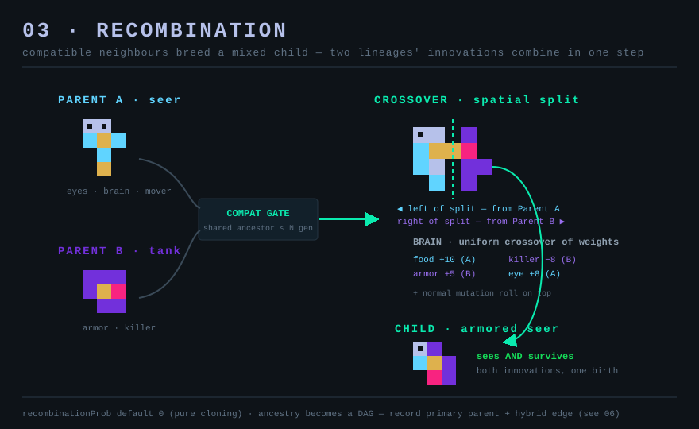

# 03 — Recombination (optional sex)

*Aim: overhaul evolution · Effort: M–L · Leverage: high · Risk: medium–high*

## Problem

Reproduction is strictly asexual cloning plus point mutation
(`Organism.reproduce`, `Organism.ts:268`). Two beneficial traits that arise in
two different lineages can never combine — one line has to re-evolve the other's
innovation from scratch. That caps how fast complexity can accumulate and means
lineages only ever *diverge*, never *merge*. Real evolution's fastest engine of
novelty — recombination — is absent.

## Current code

- `reproduce()` builds `new Organism(0,0,env,this)` and inherits solely from
  `this` (the single parent). Mutation is applied to that one clone.
- Anatomy is a flat `cells[]` list with `loc_col/loc_row` offsets from a center
  pivot (`Anatomy.ts:39`), and a `Brain` of per-cell-type weights (`Brain.ts`).
  Both are cleanly serialisable and already deep-copied on inherit — the raw
  material for a crossover operator is all here.

## Proposal

Add an **optional recombination path** at reproduction. When an organism is ready
to reproduce and a *compatible* neighbour is adjacent, produce a child that mixes
both parents instead of cloning one:

- **Compatibility gate.** Cheap and lineage-based: same species, or shared
  ancestor within N generations (`Species.ancestor` chain, `Species.ts:46`).
  Prevents nonsense chimeras and keeps it O(1).
- **Anatomy crossover.** Pick a spatial split (a random axis line through the
  pivot); take cells on one side from parent A, the other side from parent B,
  then run the normal connectivity/overlap repair the mutation path already
  tolerates (disconnected cells are "a feature," per `README.md`). Simplest
  viable version: for each occupied location, inherit that cell from a random
  parent.
- **Brain crossover.** Per-cell-type weight is a flat dict — inherit each weight
  from a random parent (uniform crossover is trivial and effective here).
- Then apply the existing mutation roll on top.

Gate the whole thing behind a hyperparam `recombinationProb` (default 0 = today's
pure cloning), plus an Evolution-Controls toggle. It's an *addition* to the
reproduce path, never the only path.

## Why it's exciting

- **Faster, punchier innovation.** A world can evolve eyes in one lineage and
  armor in another and then *fuse* them — the player sees genuinely novel combos
  appear suddenly, not after a long independent grind. Great Narrator material
  ("two lineages merged").
- **Population genetics behaviour.** Recombining populations behave differently
  from clonal ones — hybrid zones at biome borders (pairs beautifully with
  **02**), reticulate lineages instead of a strict tree.
- **A different flavour of world.** "Sexual" vs "clonal" becomes a headline world
  setting with visibly different evolutionary dynamics — replay value.

## Effort

Medium–large. The crossover operators themselves are small given how clean
`Anatomy`/`Brain` serialisation is. The cost is the *reproduction trigger*:
finding an adjacent compatible partner needs a neighbourhood scan on the
reproduce path, and reproduction currently assumes one parent throughout
(species assignment, fossil-record ancestry at `Organism.ts:334`). Ancestry
becomes a DAG, not a tree — see **06**, which must handle two parents.

## Risks

- **Ancestry model.** `FossilRecord`/`Species.ancestor` assume a single parent.
  Either record the "primary" parent for the tree and note the secondary, or
  upgrade the model. Decide before building **06**.
- **Perf.** Partner-finding on every ready-to-reproduce organism. Bound it: only
  scan when `recombinationProb` fires, only immediate neighbours.
- **Chaos.** Ungated crossover across dissimilar forms makes unviable junk every
  birth. The compatibility gate is load-bearing, not optional.

## Tests

- `recombinationProb = 0` → reproduce path is byte-identical to today.
- A child of two known parents contains only cells/weights present in one parent
  (pre-mutation).
- Incompatible neighbour → falls back to cloning, no crash.
