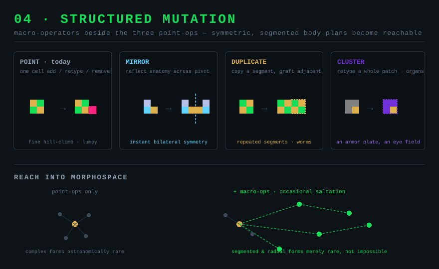

# 04 — Structured mutation

*Aim: overhaul evolution · Effort: M · Leverage: medium–high · Risk: medium*

## Problem

Mutation only ever touches **one cell at a time**: add a random cell, retype a
random cell, or remove a random cell — three independent flat rolls
(`Organism.mutate`, `Organism.ts:348`). Every complex body plan has to be reached
one lucky single-cell step at a time, and each step is as likely to break
symmetry as to build it. The result: most evolved forms are lumpy and
irregular, and elegant structures (radial symmetry, repeated segments, paired
organs) are astronomically unlikely to arise or survive. Real morphology evolves
in *modules* — duplicated and mirrored — which is exactly what's missing.

## Current code

- `mutate()`: `addProb` adds one randomized cell adjacent to a random existing
  cell; `changeProb` retypes one; `removeProb` removes one. All three at flat
  hyperparam probabilities (`Hyperparameters.ts`).
- Brain mutation is one weight per birth (`Brain.mutate`, `Brain.ts:238`), and
  only movers even roll for it (10% branch, `Organism.ts:294`).
- Cells carry a pivot-relative `loc_col/loc_row` (`Anatomy.ts`), so mirroring is
  a sign flip — the geometry for structured operators is trivial.

## Proposal

Add a few **macro-mutation operators** alongside the three point ops, each behind
its own probability hyperparam (all default low, so behaviour shifts gently):

- **Duplicate segment.** Copy a small connected cluster of cells and graft the
  copy adjacent — the raw material for repeated segments (worm-like bodies,
  producer arrays).
- **Mirror.** Reflect the anatomy (and mirror eye slit directions) across an
  axis through the pivot. Instantly produces the bilateral/radial symmetry that
  single-cell mutation almost never stumbles into. Because `loc_col/loc_row` are
  pivot-relative, this is a coordinate sign flip plus the existing overlap check.
- **Retype a whole cluster.** Convert a contiguous patch to one type in a single
  step — evolves *organs* (an eye field, an armor plate) instead of lone cells.
- **Brain: mutate more than one weight, and for non-movers too.** Sensing without
  moving still matters (shooters, explode-on-contact); let any organism with a
  brain tune more than one reaction per birth.

Keep the existing point ops — they're the fine-grained hill-climbing. The macro
ops are the occasional big structural jumps that make the search reach further.

## Why it's exciting

- **Prettier, more legible creatures.** Symmetric, segmented forms are both more
  lifelike and easier for a viewer to read at a glance — directly serves the
  "payoff of observing" goal.
- **Reachable complexity.** Structures that are currently effectively impossible
  become merely rare, so worlds explore a much richer morphospace over a session.
- **Punctuated jumps.** A mirror or duplication is a visible saltation — a great
  "new lifeform" Narrator beat, distinct from gradual drift.

## Effort

Medium. Each operator is a small anatomy transform reusing existing primitives
(`addInheritCell`, `canAddCellAt`, `removeCell`) plus the same
overlap/connectivity tolerance the point ops already rely on. The care is in
*rates*: macro-mutations must be rare relative to point ops or every birth is a
monster.

## Risks

- **Runaway size.** Duplication can balloon cell counts and tick cost. Cap
  duplicated-cluster size and let **01**'s metabolic upkeep punish gratuitous
  bloat (these two proposals reinforce each other).
- **Save compat.** New hyperparams only — default them low/off in `applyDefaults`
  (`Hyperparameters.ts:53`), so old saves load unchanged.
- **Determinism in tests.** Macro ops widen the RNG surface; test the operators
  directly (given a seed anatomy, assert the transformed shape) rather than
  asserting on emergent runs.

## Tests

- Mirror of a known anatomy produces the sign-flipped anatomy with mirrored eye
  directions and no overlaps.
- Duplicate-segment respects the size cap and never places overlapping cells.
- All macro probs at 0 → `mutate()` matches today's three-roll behaviour.
