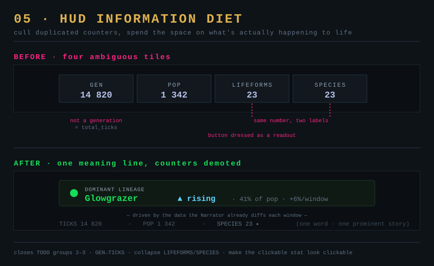

# 05 — HUD information diet

*Aim: cull information · Effort: S · Leverage: high (legibility) · Risk: low*

## Problem

The always-on HUD spends its pixels on raw, partly-duplicated, partly-misleading
counters — and none of them answer the question a viewer actually has: *what is
happening to life right now?* The `TODO.md` interface review already catalogues
the specific offenders; this proposal is the design decision that ties them
together: **cull the counters, spend the space on meaning.**

## Current code (from the TODO.md interface review)

- **`GEN:` is not a generation count** — bound to `env.total_ticks`
  (`HudTopCenter.tsx:13`), incremented once per tick. It's a clock labelled as
  ancestry.
- **`LIFEFORMS` and `Species` are the same number** — both call
  `FossilRecord.numExtantSpecies()` (`HudTopCenter.tsx:15`, `StatsTab.tsx:41`),
  under two labels.
- **`LIFEFORMS` is a button dressed as a readout** — `.statButton` strips it to
  look pixel-identical to the inert `GEN`/`POP` beside it.
- Raw `POP` and species count sit up top permanently, competing with the world
  for attention while conveying the least story-per-pixel of anything on screen.

## Proposal

A three-move diet:

1. **De-duplicate and rename** (pure naming, no behaviour — the cheap win).
   `GEN` → `TICKS` (or surface a real generation figure). Collapse
   `LIFEFORMS`/`Species` to one word, used everywhere. Make the clickable one
   *look* clickable. This closes TODO groups 2–3 outright.
2. **Demote raw counters to a single quiet line.** `TICKS · POP · SPECIES`
   become one small muted row, not three prominent tiles. They're reference
   values, not the headline.
3. **Promote one meaning line in their place.** A single always-on readout of
   *what's changing*: the current dominant lineage and its trend
   (▲ rising / ▼ crashing), driven by the data the `Narrator` already computes
   each update window (`Stats/Narrator.ts` — it already diffs the extant-species
   set, population, and the size record). The Narrator does the detection; this
   is just a persistent surface for its current state instead of only toasts.

Net: fewer numbers, each one earns its place, and the most prominent element is
the one that tells a story.

## Why it's exciting

- **Every glance pays off.** Instead of decoding four ambiguous counters, the
  player reads one line and knows the state of the world. That's the difference
  between "a screensaver of dots" and "a world I'm following."
- **It makes the deeper proposals legible.** Metabolic squeezes (**01**), biome
  frontiers (**02**), and world events (**07**) all express themselves as
  shifts in dominant lineage and population trend — exactly what the promoted
  line shows.
- **Cheapest high-impact item in the set.** Mostly deletion and renaming.

## Effort

Small. Items 1–2 are edits to `HudTopCenter.tsx` / `StatsTab.tsx` and a CSS
pass. Item 3 reuses the Narrator's already-computed per-window snapshot; the only
new work is exposing "current dominant lineage + trend" as engine-readable state
rather than only as a fired toast.

## Risks

- **Don't over-cull.** Power users read `POP`/`SPECIES`; keep them, just quiet.
  The diet is about hierarchy, not removal.
- **Trend flicker.** Dominant-lineage churn between windows could make the
  promoted line jitter. Use the Narrator's existing coalescing/threshold logic
  (it already guards against noise for toasts) so the line is stable.

## Tests

- Renamed labels present; `numExtantSpecies` surfaced under exactly one label.
- The clickable stat has a visible affordance distinct from inert readouts.
- Promoted line reflects the Narrator's current dominant-lineage snapshot and
  updates on the same cadence as the fossil-record data window.
