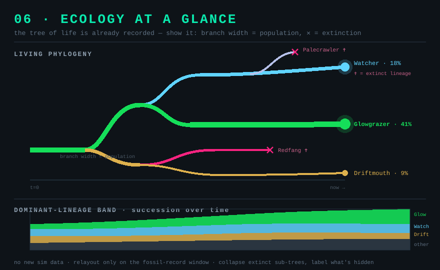

# 06 — Ecology at a glance

*Aim: cull information · Effort: M · Leverage: high (legibility) · Risk: low–medium*

## Problem

The story of a run — who descended from whom, which lineages are winning, when
the crashes happened — is *fully recorded* and *never shown*. `Species.ancestor`
(`Species.ts:46`) links every species to its parent, the `FossilRecord` keeps the
history, and there's already chart infrastructure (`Stats/Charts/`,
`ChartController`, `ChartSpecs`). But the player sees stat *panels* — tables of
numbers — instead of the shape of the ecology. The most compelling artifact the
sim produces (its tree of life) is invisible.

## Current code

- `Species.ancestor` / `FossilRecord` — the phylogeny is already a linked
  structure in memory. (Note: **03 recombination** would make this a DAG; design
  for a primary-parent tree with optional secondary edges.)
- `Stats/Charts/ChartController.ts` + `ChartSpecs.ts` — existing charting.
- `StatsTab.tsx` — current numbers-first stats surface.
- `Narrator.ts` — already tracks dominant lineages and population per window.

## Proposal

Two legible views built on data that already exists:

1. **Living phylogenetic tree.** Render the ancestry as a tree/timeline: each
   lineage a branch, branch thickness = population, branches that end = extinction
   (the Narrator already names these). Extant lineages glow at the leading edge.
   This turns "23 species" into a picture you can read — where the diversity came
   from and which branches are thriving. Clicking a branch selects that lineage
   (hooks the planned **follow-a-lineage** camera in `TODO.md`).
2. **Dominant-lineage band.** A thin stacked-area strip (top 4–5 lineages by
   population + an "other" band) scrolling with time — the one chart that shows
   competition and succession at a glance. Reuse `ChartController`.

These *replace* the numbers-first stat panels as the default stats view (the raw
tables move behind a "details" disclosure). Fewer tables, one tree, one band.

## Why it's exciting

- **The tree of life is the whole point.** A cellular-evolution sim whose
  headline artifact is a growing, branching, thinning tree of real lineages is
  dramatically more compelling than one showing `SPECIES: 23`. This is the single
  biggest "wow, it's actually evolving" moment available, and the data is already
  there.
- **It closes the loop with the mechanics.** Give selection teeth (**01**) or
  fracture the map into biomes (**02**) and the tree visibly bushes out and
  prunes — cause and effect the player can watch.
- **Shareable.** A phylo tree from a long run is a screenshot people post.

## Effort

Medium. No new simulation data — this is a rendering/layout problem over existing
structures. A tidy incremental tree layout is the real work (lay out branches
without reflowing the whole tree every window; the fossil record updates on a
fixed cadence, which bounds churn). The stacked band is largely `ChartController`
config.

## Risks

- **Tree scale.** Long runs spawn many lineages; an unpruned tree becomes hair.
  Collapse extinct sub-trees, cap visible depth/breadth, and — per `TODO.md`'s
  "no silent caps" principle — label what's collapsed rather than hiding it.
- **Perf.** Don't relayout every frame; rebuild only on the fossil-record data
  window, cache the layout, animate between snapshots.
- **DAG from recombination.** If **03** ships, a strict tree lies about hybrids.
  Pick the primary-parent-tree-plus-hybrid-edges model up front.

## Tests

- A known ancestry chain renders as the expected parent→child branches.
- An extinction marks its branch terminated at the recorded `end_tick`.
- Clicking a branch selects that species (drives the follow-a-lineage hook).
