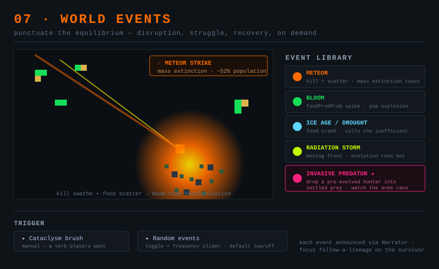

# 07 — World events (punctuated equilibrium)

*Aim: make it exciting · Effort: M · Leverage: high (drama) · Risk: low–medium*

## Problem

Left alone, a world reaches a stable attractor and *stays there* — the same
producer mat, tick after tick. Stasis is realistic but it isn't watchable. Real
evolution's most dramatic chapters are the **disruptions**: the meteor, the ice
age, the invasive species that rewrites the board. The sim has no mechanism for
punctuation — no way, short of the player manually painting, to knock a settled
world off its equilibrium and force it to re-adapt.

## Current code

- Player already has disruptive brushes — food, walls, **radiation** (×5
  mutability, `Organism.ts:289`), kill, perlin mazes, day/night — but they're
  manual and one-off, not events with arc and narration.
- `Narrator.ts` already fires toasts for new lifeforms, extinctions, size records,
  and **mass extinctions** (≥40% pop drop) — the vocabulary for dramatising events
  already exists.
- `WorldEnvironment.update` already runs a global timed toggle (day/night,
  `WorldEnvironment.ts:318`) — the hook for scheduled events is right there.

## Proposal

A small library of **world events**, each a bounded change to the environment
over a window, either player-triggered (a button / brush) or auto-scheduled at a
tunable interval. Built from mechanics that already exist:

- **Meteor / cataclysm.** Kill a swathe (existing kill path) + scatter food from
  the dead (organisms already turn to food on death, `README.md`) → mass
  extinction + boom-time recolonisation. The Narrator's mass-extinction toast
  already covers the aftermath.
- **Bloom.** Temporary global `foodProdProb` spike → population explosion and a
  burst of speciation, then the crash when it ends.
- **Ice age / drought.** Temporary `foodProdProb` crash (or, with **01**, an
  upkeep spike) → squeeze that culls the inefficient and rewards lean forms.
- **Radiation storm.** A moving/expanding radiation front — evolution runs hot
  along the wavefront.
- **Invasive predator.** Drop a pre-evolved hunter (from a preset, or sampled
  from another world via existing save/deploy plumbing) into a settled prey world
  → an arms race the player can watch, and the clearest single "wow" in the sim.

Expose as: a "Cataclysm" tool palette group (manual) + an Evolution-Controls
"random events" toggle with a frequency slider (auto). Each event announces
itself through the Narrator and, ideally, focuses the planned follow-a-lineage
camera (`TODO.md`) on the lineage that survives it.

## Why it's exciting

- **It manufactures the good parts.** Every event is a beginning-middle-end story
  — disruption, struggle, recovery — on demand, instead of waiting for one to
  happen by chance. This is the most direct answer to "make it more exciting."
- **It shows off everything else.** Events are how the player *feels* metabolic
  cost (**01**), biome structure (**02**), and reachable complexity (**04**):
  each proposal's payoff spikes during a cataclysm.
- **Agency.** "Drop a meteor and see what survives" is a verb people want. It
  turns passive watching into experimentation.

## Effort

Medium, and front-loaded on reuse — most events are timed compositions of
existing brushes/params. The genuinely new pieces are the event scheduler/state
machine (start → sustain → end, with cleanup) and the invasive-predator preset
pipeline. Start with meteor + bloom (pure reuse) to prove the framework, then add
the rest.

## Risks

- **Save/restore.** An event mid-flight is transient world state — decide whether
  saving during an event captures it or lets it lapse. Prefer events that fully
  resolve so saves stay simple.
- **Griefing the sim.** Frequent auto-events prevent any equilibrium from forming
  at all. Default the frequency low; events should punctuate stasis, not replace
  it.
- **Determinism.** Auto-events widen RNG; keep them off by default so benchmark
  and test runs stay reproducible (`npm run bench` interleaving depends on it).

## Tests

- A meteor kills organisms in its footprint and leaves food; the Narrator fires
  its mass-extinction toast when the drop clears threshold.
- A bloom raises then restores `foodProdProb` exactly, with no residual drift.
- Random-events off → tick sequence identical to today (the reproducibility guard).
